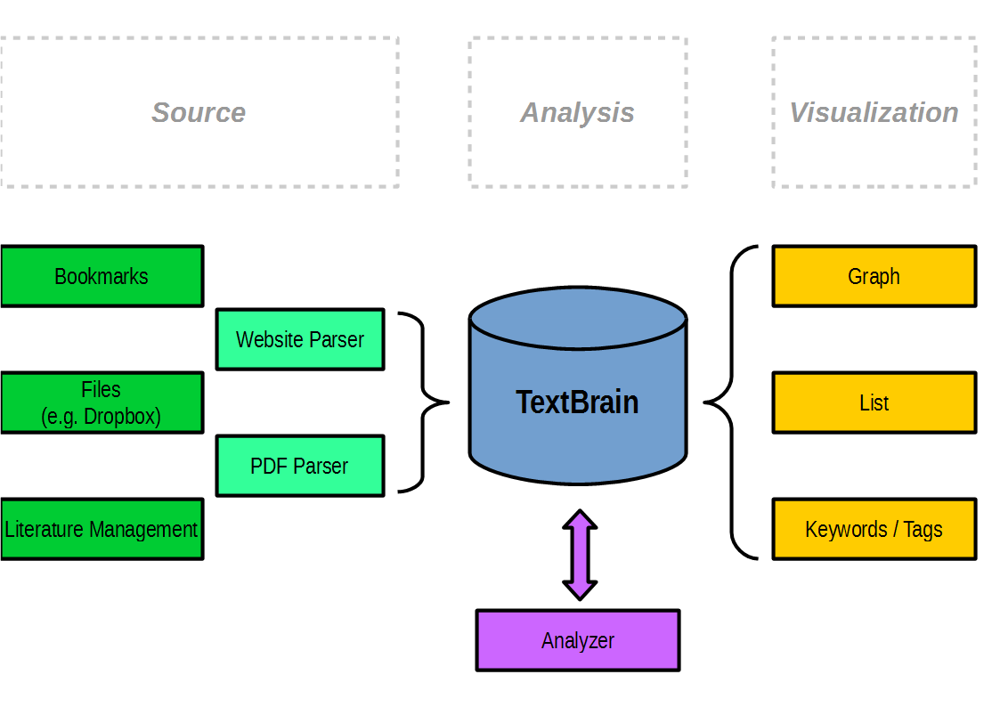

# textbrain
Tools to fill and read _your textbrain_

## What it is suppposed to be
* A database containing all texts relevant to you
* A __personal search engine__
* A possibilty to organize your knowledge
* A way to analyze actually important documents
* A cloud based system
* Based on [mongodb](https://www.mongodb.org/)

## What it is __not__
* A database
* A google
* A file server
* Complete

## The Idea

